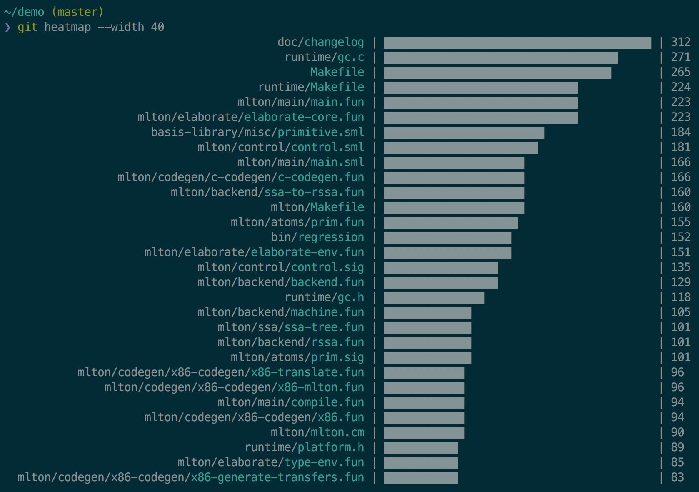

# git-heatmap

> Display a heatmap for oft-edited files



## Install

### Dependencies

You must have the either `barchart` or `bars` command on your system first. Pick
your poison:

```bash
# either:
npm install -g https://github.com/jez/bars.git
# or:
cargo install --git https://github.com/jez/barchart.git
```

### Installation

Download `git-heatmap` and put it on your path.

```bash
# Homebrew:
brew install jez/formulae/git-heatmap
```

## Usage

```
❯ git heatmap -h
Heatmap of oft-edited files.

Usage:
  git heatmap [options] [<path>...]

Options:
  -n <top>                      Limit to top <n> files. [default: 30]
  --width <n>                   Limit histogram to <n> chars.
  -b <branch>, --base <branch>  Compare relative to <branch>. If on <branch>,
                                show heatmap for entire repo. [default: master]
  -c <char>, --char <char>      Use <char> to draw the bars. [default: █]
  -f <cmd>, --filter <cmd>      Filter output through <cmd> before creating the
                                the histogram.
  -a, --all                     Include directories and parent directories of
                                files in the histogram. [default: false]
  -h                            Show this message.
```

## FAQ

- **How do I disable color?**

  Color is automatically disabled when output is not to a TTY (for example, when
  piping to another command or redirecting to a file). If you need a flag to
  control this, open an issue with your use case.
  
- **How do I heatmap directories instead of files?**

  Use `--filter 'xargs dirname'`.
  
  If you want to heatmap files, directories and their parent directories, use
  `--all` instead.
  
## License

[](https://jez.io/MIT-LICENSE.txt)
